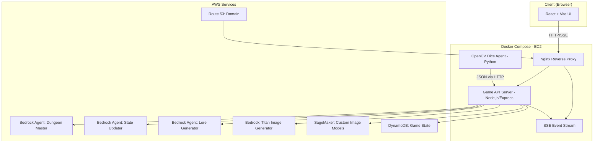

# Implementation Plan - Gen DND: Multi-Agent D&D Game Engine

## Problem Statement

Build a web-hosted, multiplayer D&D game engine where each step of the game loop is handled by a specialized AI agent (powered by Amazon Bedrock), with physical dice reading via OpenCV, real-time UI updates, generated/illustrated maps, and character imagery — all orchestrated through Bedrock Agents and deployed via Docker Compose at `/gen-dnd`.

## Requirements

| # | Requirement |
|---|---|
| R1 | Pregame: Generate lore/world based on source material (movie, TV show, book, or custom) |
| R2 | Pregame: Select game length (Short ~5, Medium ~15, Long ~30 events) |
| R3 | Game loop: DM agent provides narrative context, prompts dice rolls |
| R4 | Game loop: OpenCV agent reads physical dice → JSON `{dice_type, roll_value}` |
| R5 | Game loop: Dice re-roll prompt on failed read, virtual fallback on second failure |
| R6 | Game loop: Update agent modifies lore/character stats based on roll outcomes |
| R7 | DM-agent driven turn system (initiative in combat, freeform in exploration) |
| R8 | Multiplayer: Multiple players, each with their own character |
| R9 | Web UI: React (Vite), character images, stats, game state, map display |
| R10 | Maps: Illustrated campaign overview at start + grid tile map per event |
| R11 | Images: Bedrock (Titan Image) for quick gen, SageMaker for custom models, pre-made assets |
| R12 | Persistence: DynamoDB for game state |
| R13 | Real-time: SSE for pushing game events to clients |
| R14 | Deployment: Docker Compose on EC2, Route 53 domain |
| R15 | All AI via Amazon Bedrock Agents / SageMaker |

## Architecture

## Agent Roles

| Agent | Model | Responsibility |
|-------|-------|---------------|
| **Lore Generator** | Claude (Anthropic) | Pregame world-building from source material, event planning |
| **Dungeon Master** | Claude (Anthropic) | Narrative progression, turn decisions, event descriptions |
| **State Updater** | Claude (Anthropic) | Parse dice outcomes, update character stats/lore/map state |
| **Image Generator** | Titan Image / SageMaker | Character portraits, scene illustrations, map tiles |
| **Dice Reader** | OpenCV (no LLM) | Camera → dice detection → JSON output |

## Proposed Solution

A Node.js/Express backend orchestrates the game loop by calling Bedrock Agents for each phase. The React frontend connects via SSE for real-time narrative updates. The OpenCV dice agent runs as a separate Python container exposing an HTTP endpoint. DynamoDB stores all game/session/player state. Docker Compose ties it all together behind Nginx.

---

## Task Breakdown

### Task 1: Project Scaffolding & Docker Compose Foundation

- **Objective**: Set up the `/gen-dnd` monorepo structure with Docker Compose, basic service containers, and dev tooling.
- **Implementation**:
  - Create `/gen-dnd` with subdirectories: `frontend/`, `backend/`, `dice-agent/`, `infra/`, `docker/`
  - Initialize Vite + React app in `frontend/`
  - Initialize Node.js + Express + TypeScript in `backend/`
  - Initialize Python project in `dice-agent/`
  - Create `docker-compose.yml` with services: frontend, backend, dice-agent, nginx
  - Nginx config for reverse proxy (frontend on `/`, API on `/api`, SSE on `/events`)
  - `.env.example` for AWS credentials, region, table names
- **Tests**: Docker Compose builds and starts all containers; hitting `http://localhost` shows React placeholder page; `/api/health` returns 200.
- **Demo**: All containers running, browser shows React app, API health check responds.

---

### Task 2: DynamoDB Schema & Data Layer

- **Objective**: Design and implement the DynamoDB tables and a data access layer in the backend.
- **Implementation**:
  - Tables: `GameSessions` (PK: sessionId), `Players` (PK: sessionId, SK: playerId), `GameEvents` (PK: sessionId, SK: eventNumber), `GameState` (PK: sessionId — current map, lore, turn info)
  - Create `infra/dynamodb-tables.json` (CloudFormation or SDK-based table creation script)
  - Backend data layer: `src/db/` with typed CRUD functions for each table
  - Use `@aws-sdk/client-dynamodb` + `@aws-sdk/lib-dynamodb`
- **Tests**: Unit tests for CRUD operations against DynamoDB Local (Docker container). Create, read, update game session and player records.
- **Demo**: Run tests showing game sessions and players being persisted and retrieved from DynamoDB Local.

---

### Task 3: SSE Real-Time Event System

- **Objective**: Implement server-sent events so the backend can push game events to connected clients.
- **Implementation**:
  - `backend/src/sse/` — SSE manager that tracks connected clients per session
  - Express endpoint `GET /api/events/:sessionId` — SSE stream
  - Event types: `narrative`, `dice_request`, `dice_result`, `state_update`, `turn_change`, `map_update`, `error`
  - Client-side hook `useGameEvents(sessionId)` in React
- **Tests**: Integration test — connect SSE client, push event from backend, verify receipt. Test reconnection handling.
- **Demo**: Browser connects to SSE endpoint; backend pushes a test narrative event; UI displays it in real-time.

---

### Task 4: Pregame - Lore Generator Agent (Bedrock)

- **Objective**: Build the Lore Generator Bedrock Agent that creates world lore, characters, event outlines, and the campaign map concept from source material.
- **Implementation**:
  - Create Bedrock Agent (via SDK or console config in `infra/`)
  - Agent instructions: Accept source material description + game length → output structured JSON: `{world_lore, locations[], factions[], event_outlines[], campaign_map_description, suggested_characters[]}`
  - Backend service `src/agents/loreGenerator.ts` — invokes agent, parses response, stores in DynamoDB
  - API endpoint `POST /api/game/create` — accepts `{source_material, game_length, player_count}`
  - Generates event count based on length preset (5/15/30)
- **Tests**: Mock Bedrock response; verify JSON parsing, DynamoDB storage, correct event count allocation. Integration test with real Bedrock call.
- **Demo**: Hit create endpoint with "Lord of the Rings, short" → get back structured lore with 5 event outlines stored in DynamoDB.

---

### Task 5: Pregame - Image Generation Pipeline

- **Objective**: Generate campaign overview map + initial character portraits using Bedrock Titan Image and/or pre-made assets.
- **Implementation**:
  - `backend/src/agents/imageGenerator.ts` — calls Bedrock Titan Image Generator (or SageMaker endpoint if configured)
  - Campaign map: Use lore's `campaign_map_description` as prompt → generate illustrated overview map
  - Character portraits: Generate from `suggested_characters[]` descriptions
  - Store generated images in `./assets/` volume (or S3 later)
  - Fallback: load from `assets/defaults/` if generation fails
  - API endpoint `GET /api/game/:sessionId/assets/:assetId`
  - Grab placeholder test images for development
- **Tests**: Unit test image prompt construction. Integration test with Bedrock Titan. Verify fallback to default assets.
- **Demo**: Create a game → campaign map image and character portrait images are generated and viewable via the assets endpoint.

---

### Task 6: Player Lobby & Character Creation UI

- **Objective**: Build the React pregame flow — source selection, game creation, player join, character assignment.
- **Implementation**:
  - Pages: `/` (home), `/create` (new game form), `/lobby/:sessionId` (waiting room), `/game/:sessionId` (main game)
  - Create game form: source material input (text/dropdown for movie/show/book/custom), game length selector
  - Lobby: Shows join link, connected players, generated lore summary, campaign map, character selection
  - Players pick or are assigned characters from `suggested_characters[]`
  - Character card component: portrait image, name, class, base stats (HP, STR, DEX, INT, WIS, CHA)
  - React Router, TanStack Query for API calls
- **Tests**: Component tests for game creation form, lobby display, character card rendering. E2E: create game → land in lobby with lore displayed.
- **Demo**: Full pregame flow in browser — create a game, see lore/map generated, join as player, pick character.

---

### Task 7: Dungeon Master Agent & Game Loop Core

- **Objective**: Implement the DM Bedrock Agent that drives the narrative, manages turns, and requests dice rolls.
- **Implementation**:
  - Bedrock Agent with session memory — receives game state context (current event, player stats, lore, previous events)
  - Outputs structured response: `{narrative_text, action_required: "dice_roll"|"choice"|"none", target_player_id, dice_type: "d4"|"d6"|"d8"|"d10"|"d12"|"d20", next_turn_player_id}`
  - Backend game loop service `src/game/gameLoop.ts`:
    1. Call DM agent with current state
    2. Push narrative via SSE
    3. If dice roll needed → push `dice_request` event to target player
    4. Wait for dice result (from OpenCV agent or virtual)
    5. Call State Updater agent
    6. Push state update via SSE
    7. Check if game complete (all events exhausted)
    8. Loop
  - Turn management: DM agent decides next player based on context
  - API: `POST /api/game/:sessionId/start` kicks off the loop
- **Tests**: Unit test game loop state machine with mocked agents. Test turn transitions, dice request flow, game completion.
- **Demo**: Start a game → DM narrates first event, requests a dice roll from player 1 via SSE, game pauses awaiting roll.

---

### Task 8: OpenCV Dice Agent

- **Objective**: Build the Python dice-reading agent that processes camera input and outputs dice roll JSON.
- **Implementation**:
  - Python FastAPI service in `dice-agent/`
  - Endpoints: `POST /read` (accepts image/frame) → returns `{dice_type, roll_value, confidence}`
  - `GET /status` — health check
  - OpenCV pipeline: frame preprocessing → contour detection → pip counting (d6) / number OCR (d20, d10, etc.)
  - For polyhedral dice: use template matching or digit recognition
  - Configurable confidence threshold; below threshold → return `{success: false}`
  - Backend integration: `POST /api/game/:sessionId/dice-result` — accepts JSON from dice agent, feeds into game loop
  - Virtual dice fallback endpoint: `POST /api/game/:sessionId/dice-virtual` — RNG roll when camera fails
- **Tests**: Unit tests with sample dice images (d6, d20). Test confidence thresholds. Test failure/retry flow.
- **Demo**: Send a test image of a d20 to the dice agent → get back `{dice_type: "d20", roll_value: 15, confidence: 0.92}`. Virtual fallback also works.

---

### Task 9: State Updater Agent & Stats System

- **Objective**: Build the State Updater Bedrock Agent that interprets dice outcomes and modifies game state.
- **Implementation**:
  - Bedrock Agent — receives: `{dice_result, current_event_context, player_stats, dm_narrative}`
  - Outputs: `{stat_changes: [{player_id, stat, delta}], lore_updates: string, map_changes: {new_tile_state}, event_outcome: string, is_event_complete: boolean}`
  - Backend service `src/agents/stateUpdater.ts` — invokes agent, applies changes to DynamoDB
  - Stat system: HP, STR, DEX, INT, WIS, CHA + inventory items + status effects
  - Map grid update: mark tiles as explored, add/remove entities
  - Event progression: increment event counter when `is_event_complete`
- **Tests**: Mock dice result + context → verify stat changes applied correctly in DB. Test HP boundary (can't go below 0, death handling). Test event progression counter.
- **Demo**: Simulate a dice roll in active game → stats update in DB, SSE pushes updated character card to UI, map tile changes.

---

### Task 10: Game UI - Main Game View

- **Objective**: Build the full in-game React UI with narrative feed, character panels, map, and dice interaction.
- **Implementation**:
  - Layout: Left panel (map), Center (narrative feed + dice area), Right panel (player stats/character)
  - Components:
    - `NarrativeFeed` — scrolling text of DM narration (SSE `narrative` events)
    - `DiceArea` — shows when roll requested, displays result, virtual roll button (fallback)
    - `CharacterPanel` — portrait, stats bars, inventory, status effects (updates via SSE)
    - `MapView` — campaign illustration + grid overlay showing explored/current tiles
    - `TurnIndicator` — whose turn it is
    - `GameOverScreen` — final summary when all events complete
  - Responsive layout, bit-art/pixel-art styling for character images
  - SSE integration via `useGameEvents` hook from Task 3
- **Tests**: Component tests for each panel. Integration test: mock SSE events → verify UI updates (narrative appears, stats change, map updates).
- **Demo**: Full game UI visible — narrative flows in, dice requests appear, stats update, map shows exploration progress across multiple turns.

---

### Task 11: Grid Map Generation & Per-Event Updates

- **Objective**: Generate the tile-based grid map at game start and update it per event.
- **Implementation**:
  - Map generator service: Takes lore locations → generates grid layout (NxN grid with terrain types, POIs, paths)
  - Use Bedrock (Claude) to plan grid layout from lore → structured JSON `{tiles: [{x, y, terrain, name, is_poi}]}`
  - Titan Image: Generate tile artwork per terrain type (forest, mountain, town, dungeon, etc.)
  - Per-event: State Updater marks player positions, fog-of-war reveal, enemy positions
  - Frontend `MapView` component renders grid with tile images, player tokens, fog overlay
  - Store map state in DynamoDB `GameState` record
- **Tests**: Map generation from lore produces valid grid. Tile reveal logic works. Player position updates correctly.
- **Demo**: Start game → grid map generated with illustrated tiles. As events progress, fog clears, player token moves.

---

### Task 12: Multiplayer Session Management

- **Objective**: Handle multiple players joining, turn coordination, and concurrent connections.
- **Implementation**:
  - Join flow: Share session link → player registers name → assigned/picks character
  - SSE channels: Per-player targeted events (e.g., "it's your turn to roll") + broadcast events (narrative, map)
  - Turn locking: Only active player can submit dice results
  - Player disconnect handling: DM agent skips disconnected player after timeout, or AI takes their turn
  - Session state: `waiting_for_players`, `in_progress`, `paused`, `completed`
  - API: `POST /api/game/:sessionId/join`, `GET /api/game/:sessionId/players`
- **Tests**: Multi-client SSE test. Turn lock enforcement. Disconnect/reconnect flow. Player join mid-lobby.
- **Demo**: Two browser tabs join same game. DM narrates, asks Player 1 to roll. Player 2 sees narrative but can't roll. Turns alternate correctly.

---

### Task 13: Nginx, Docker Compose Production Config & Route 53

- **Objective**: Production-ready deployment with domain, HTTPS, and optimized containers.
- **Implementation**:
  - Nginx config: SSL termination (Let's Encrypt / certbot), reverse proxy rules, static file serving for React build, gzip
  - Docker Compose production overrides: resource limits, restart policies, health checks, log rotation
  - Route 53: Hosted zone setup script, A record pointing to EC2 public IP
  - `Makefile` or `deploy.sh` for one-command deployment
  - Environment variable management for Bedrock/SageMaker credentials (IAM role on EC2 preferred)
  - DynamoDB: Switch from local to AWS-hosted tables
- **Tests**: Full compose up with production config. HTTPS accessible. All API endpoints respond. SSE works through Nginx.
- **Demo**: Access game via domain name (or IP), full HTTPS, create and play through a complete short game (5 events) end-to-end.

---

### Task 14: End-to-End Integration & Polish

- **Objective**: Wire everything together, handle edge cases, and run a full playthrough.
- **Implementation**:
  - Full integration test: Create game → join players → play through all events → game over screen
  - Error handling: Agent timeouts, DynamoDB throttling, image gen failures (graceful degradation)
  - Loading states in UI for agent response times
  - Game history: View past sessions/replays from event log
  - Polish: Animations for dice rolls, narrative typing effect, stat change highlights, map transition effects
  - README with setup instructions, architecture diagram, env var docs
- **Tests**: E2E test of full short game. Stress test with 4 concurrent players. Error injection testing (kill dice agent mid-game, verify fallback).
- **Demo**: Complete 5-event game played through the web UI with 2+ players, featuring generated lore, illustrated maps, physical dice reading (or virtual fallback), real-time stat updates, and game completion screen.

---

## Tech Stack Summary

| Layer | Technology |
|-------|-----------|
| Frontend | React + Vite + TypeScript + TanStack Query + React Router |
| Backend | Node.js + Express + TypeScript |
| Dice Agent | Python + FastAPI + OpenCV |
| AI Orchestration | Amazon Bedrock Agents (Claude for narrative, Titan for images) |
| Custom Images | Amazon SageMaker (custom model endpoints) |
| Database | Amazon DynamoDB |
| Real-time | Server-Sent Events (SSE) |
| Deployment | Docker Compose + Nginx + Let's Encrypt |
| DNS | Amazon Route 53 |
| Infrastructure | EC2 instance with IAM role for AWS service access |
